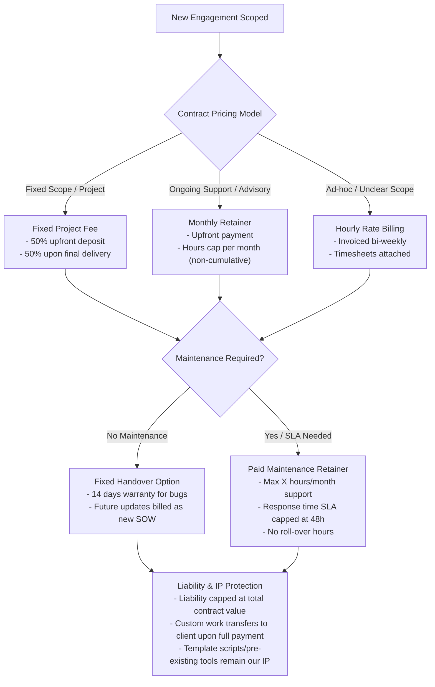

# Client Engagement & Legal Playbook

This guide outlines our targeting strategy, core service offerings, and the legal framework checklist for scoping and closing consulting agreements with minimal risk.

---

## 1. Target Client Profiles (SMBs)

We focus on Small and Medium-Sized Businesses (SMBs) that are experiencing growth but are constrained by manual processes and lack of specialized data engineering.

*   **Size**: 5 to 50 employees; $500k to $5M in annual revenue.
*   **Target Roles**: Founder, CEO, Director of Marketing, or Head of Growth.
*   **Key Pain Points**:
    *   **Data Fragmentation**: Marketing data scattered across Meta, Google Ads, and CRMs.
    *   **Manual Overhead**: Staff spending hours weekly copying-pasting data between spreadsheets.
    *   **High Development Costs**: Reluctant to hire full-time developers or expensive software agencies for simple internal integrations.

---

## 2. Solutions Portfolio (Reusable Template Scripts)

To maximize margins, we design reusable script templates that can be quickly tailored for each client:

1.  **Marketing Data Sync**:
    *   *Concept*: A Python script that connects to the Meta/Google Ads API, pulls campaign spend, and writes it directly to Google Sheets or PostgreSQL.
2.  **Lead Enrichment & CRM Sync**:
    *   *Concept*: Webhooks that capture form fills, enrich them using third-party APIs (e.g. Clearbit/Apollo), and load them into HubSpot.
3.  **Automated Reporting Dashboard**:
    *   *Concept*: SQL queries scheduled via GitHub Actions or Cron that aggregate database stats and send a weekly Slack/Email digest.
4.  **Custom App / Automation**:
    *   *Concept*: Lightweight tools (HTML/JS) or custom microservices for internal department tasks.

---

## 3. Legal Decision Flowchart

When structuring a new engagement, use the following logic path to select the legal parameters:

---

## 4. Client Discovery & Legal Checklist

Use this checklist during discovery calls and contract drafting to ensure all legal/operational bases are covered.

### Discovery Phase
- [ ] **Define the Pain Point**: Is it a manual time-sink, a data quality issue, or a reporting gap?
- [ ] **Establish Value Metric**: How much time or money will this automation save the client monthly?
- [ ] **Identify Key Systems**: What APIs or databases are involved? Do we need to request api keys or sandbox access?

### Agreement Structuring (Schedule A / SOW)
- [ ] **Scope Definition**: Explicitly state what *is* and *is not* in scope (prevents scope creep).
- [ ] **Intellectual Property (IP)**:
    *   *Clause Check*: Ensure custom-built code transfers *only* upon final payment clearance.
    *   *Exclusion*: Specify that general-purpose code libraries, templates, and pre-existing script components remain the Consultant's property.
- [ ] **Limitation of Liability**:
    *   *Clause Check*: Restrict liability to the total fees paid under the specific SOW (never unlimited liability).
    *   *Consequential Damages*: Exclude liability for lost profits, downtime, or data loss.
- [ ] **Maintenance Boundaries**:
    *   *Clause Check*: Declare that unless a paid maintenance retainer is signed, the Consultant is *not* responsible for API updates, code breakage due to client changes, or hosting.
    *   *Warranty*: State a clear 14-day warranty period after delivery for fixing deployment bugs only.
- [ ] **Payment Terms**:
    *   *Upfront*: Ensure a 50% upfront payment is cleared before work begins.
    *   *Late Fee*: Define a net-14 payment window with 1.5% interest per month on late invoices.
